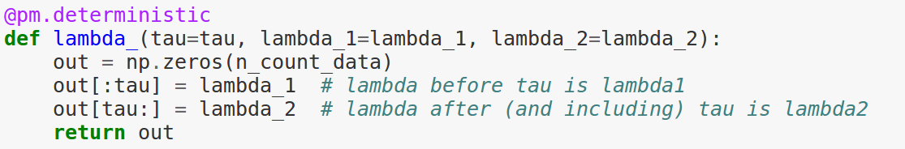

Enhusiast's intro to Probabilistic Programming 
5th June 2014

Laszlo Fogas

===============================================================================

---

Probabilistic?
==============

---

<s>"Works on my machine"</s>
============================

---

It is deterministic
===================

---

What is it used for?
====================

---

Predicting the probabilities of future outcomes
===============================================

---

Just like machine learning algoritmhs
=====================================

---

Unlike machine learning algorithms
==================================

---

Telling a plausible story is almost as important as being right
===============================================================

---

Random Forest

SVM

Deep learning

---

White box, we build probabilistic models of real world phenomenons
==================================================================

---

What is a probabilistic model?
==============================

---

Probability distribution of dice roll outcomes
==============================================

---

Uniform distribtion
===================

---

Normal distribtion
==================

---

An example 
==========

---

The model
=========

number of texts per day ~ Poisson(lambda)

switchpoint: tau ~ DiscreteUniform(1,70)

if t < tau: Poisson(lambda1)

if t > tau: Poisson(lambda2)

---

The model...
============

We don't know lambda1 or lambda2, we have only beliefs we have an idea about: continuous variable with expected value at the avg of all values

lambda 1 ~ Exp(alfa)

lambda 2 ~ Exp(alfa)

---

Pymc
====

---

Posterior
=========

---

Model as predictor
==================

---

Football model
==============

"Bayesian hierarchical model for the prediction of
football results" - Baio, Blangiardo

goals scored per team on a match ~ Poisson(teta)

home team goals ~ home + att_home + def_away

away team goals ~ att_away + def_home

home ~ Normal(0, 0.0001) att* ~ Normal(mu_att, tau_att) def* ~ Normal(mu_def, tau_def)
 
mu_att ~ Normal(0, 0.0001) mu_def ~ Normal(0, 0.0001) tau_att ~ Gamma(0.1, 0.1) tau_def ~ Gamma(0.1, 0.1)

---

Football model...
=================

http://discovery.ucl.ac.uk/16040/1/16040.pdf

---

Further reads
=============

Cam Davidson-Pilon: Probabilistic Programming & Bayesian Methods for Hackers
http://camdavidsonpilon.github.io/Probabilistic-Programming-and-Bayesian-Methods-for-Hackers/

John K. Kruschke: Doing Bayesian Data Analysis

Nate Silver: The signal and the noise

