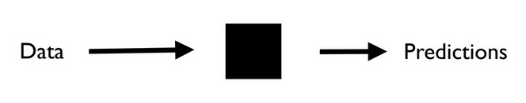
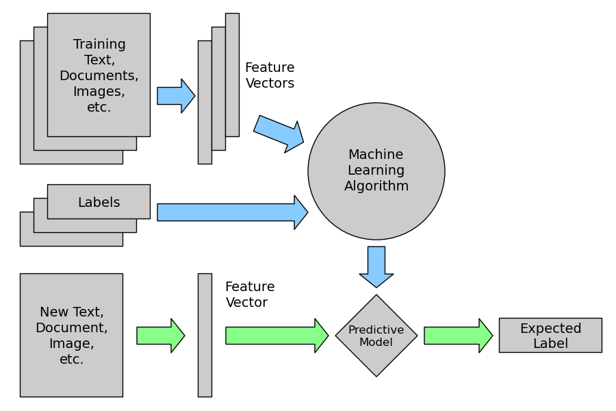
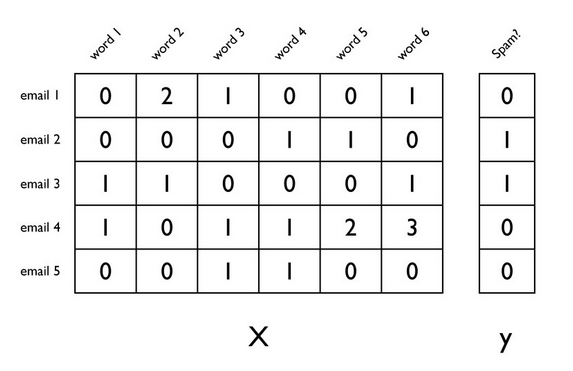
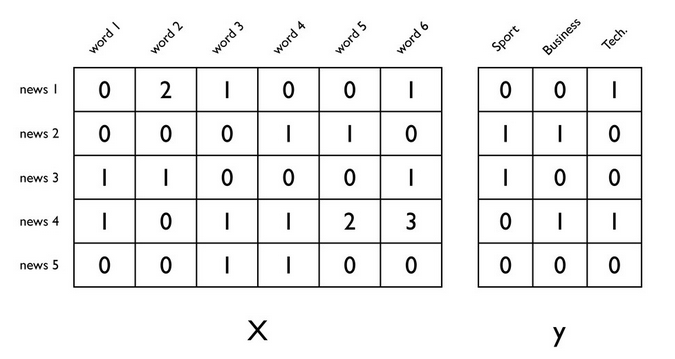
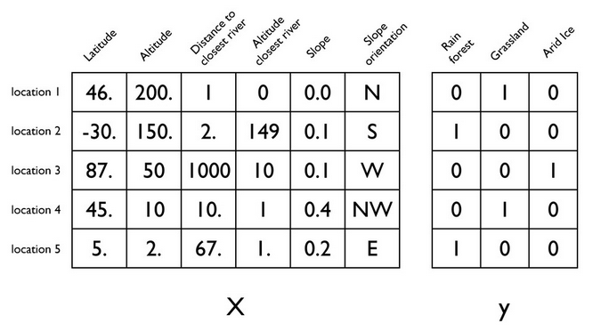
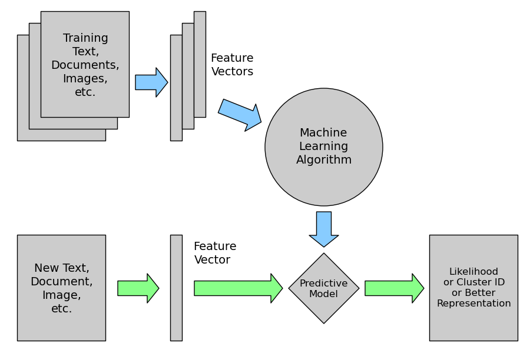
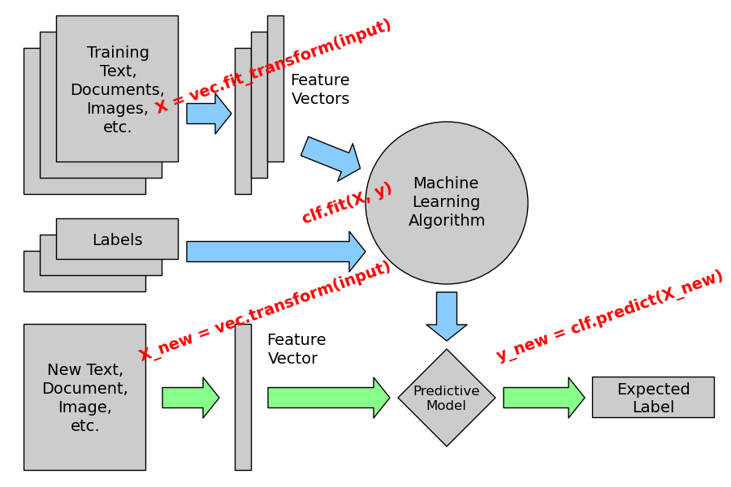

Introduction to Python Machine Learning 
6th June 2013

Laszlo Fogas

===============================================================================

---

Hi
==

 * master degree, Budapest University of Technology and Economics
 * industry background, Java
 * data guy @ Falcon Social
 * new to Python, amazed every single day
 * pragmatic guy

---

Today
=====

 * General Machine Learning concepts
 * Scikit-learn basics
 * Scikit-learn in action
 

The slides and source code are downloadable at <a href="https://github.com/laszlocph/talks/pycondk_june">https://github.com/laszlocph/talks/pycondk_june</a>

---

Concepts
========

 
 

---

Concepts - Supervised Learning
==============================

---

Feature vectors - Spam filtering
================================

---

Feature vectors - Topic classification
======================================

---

Feature vectors - Vegetation prediction
=======================================

---

... and many more applications
==============================
 * Recommendation engines 
 based on friends, preferences, or previous actions like Amazon, or "People you may know" on LinkedIn
 * Fraud detection 
 based on usage patterns
 * Language guessing 
 based on common character groups, word length distribution
 * Priority inbox 
 messages from people you frequently reply to, contains certain words (like spam filtering)
 * Sentiment analysis 
 bow, tfidf, high information words, etc

---

Concepts - Unsupervised Learning
==============================

---

Concepts - Problem groups
==============================

 * Supervised learning
 	* Classification
 	* Regression
 * Unsupervised learning
 	* Clustering
 	* Dimensionality reduction

---

Today
=====

 * General Machine Learning concepts
 * # Scikit-learn basics
 * Scikit-learn in action
 	* Classification problem from Kaggle.com
 	* We make a submission using SVM

---

Scikit-learn
============
 * open source, BSD license - commercially usable, active development
 * Fits well to the SciPy ecosystem (based on numpy)
 * many algorithms <a href="http://scikit-learn.org/stable/" target="_blank">http://scikit-learn.org/stable/</a>
 	* Linear models: logistic regression
 	* Support Vector Machines (SVM)
 	* Naive Bayes
 	* Decision Trees, Random Forest
 	* Nearest Neighbours
 	* KMeans
 	* Principal Component Analysis (PCA)
 	* many of them state of the art implementation
 * complex tool for the whole workflow: feature extraction, model selection
 * considered hot these days

---

Sklearn - The promise
=====================

Unified interface

Pragmatic approach

    !python
    clf = LinearSVC()
    clf.fit(trainingSet, trainingLabels)
    prediction = clf.predict(testSet)

---

Sklearn - Hands on
=====================

 * We need a problem
 * Kaggle.com
 	* crowed sourced heaven of predictive machine learning models
 	* problems to solve from companies like GE, Yelp or Facebook
 	* for knowledge, for job, for money
 * Tutorial competition <a href="http://www.kaggle.com/c/data-science-london-scikit-learn" target="_blank">http://www.kaggle.com/c/data-science-london-scikit-learn</a>

---

Sklearn - Cheat sheet
=====================

<a href="http://peekaboo-vision.blogspot.dk/2013/01/machine-learning-cheat-sheet-for-scikit.html" target="_blank">http://peekaboo-vision.blogspot.dk/2013/01/machine-learning-cheat-sheet-for-scikit.html</a>

---

Sklearn - where to go?
======================

Feature extraction / selection: python package NLTK for textual data

Dimensionality reduction

    
    !python
    pca = PCA(n_components=12,whiten=True)
    trainSet = pca.fit_transform(trainingSet)
    testSet = pca.transform(testSet)

Cross validation

	!python
	svm.SVC(kernel='linear', C=1)
	scores = cross_validation.cross_val_score(
		clf, iris.data, iris.target, cv=3)
	array([ 1.  ...,  0.96...,  0.9 ...])

	print "Accuracy: %0.2f (+/- %0.2f)" % (scores.mean(), 
		scores.std() / 2)
	Accuracy: 0.97 (+/- 0.02)

---

Sklearn - where to go?
======================

Parameter tuning

	!python
	param_grid = { 'C': 10 ** np.arange[-3, 4, .25]}
	grid_search = GridSearchCV(svm, pram_grid=param_grid,
	 cv=3,
	 n_jobs=-1,
	 verbose=3,
	 compute_training_score=True
	)
	grid_search.fit(trainingSet, trainingLabels)
	print(grid_search.best_params_)
	{'C': 1.0}

QA time

---

Bonus - who to follow
=====================

@ogrisel

@t3kcit

@jakevdp

@japerk

@siah

@laszlocph